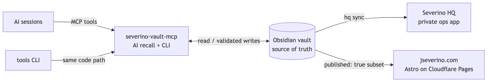

# Joe Severino

Cybersecurity graduate student at Georgia Tech focused on network security, security engineering, and the production tooling that keeps secure systems maintainable.

**Certifications:** CCNA, CompTIA Security+, ISC2 Certified in Cybersecurity (CC)

Most of my projects are built around real systems I run myself: local AI tooling with explicit safety boundaries, zero-trust homelab infrastructure, private PKI and TLS automation, DNS filtering, and the vault-to-website publishing pipeline behind my portfolio.

## Featured Projects

- **[severino-vault-mcp](https://github.com/joeseverino/severino-vault-mcp)** - Local-first MCP server that gives AI assistants safe access to an Obsidian operations vault. Layered CI security tooling (CodeQL, pip-audit, OSSF Scorecard, Dependabot), documented threat model, and a four-tier sensitivity gate for credential-adjacent content.
- **[branding-engine](https://github.com/joeseverino/branding-engine)** - Published [npm package](https://www.npmjs.com/package/branding-engine) that generates favicons, vector marks, wordmarks, social cards, brand sheets, and web tokens from one color and monogram. It is the single-source brand renderer behind [jseverino.com](https://jseverino.com), with real font-outline rendering and provenance-attested GitHub releases.
- **[sitedrift](https://github.com/joeseverino/sitedrift)** - Published [npm package](https://www.npmjs.com/package/sitedrift) for reviewing DEV against LIVE on the same route: Split, Overlay/Diff, and synchronized navigation, with response deltas and SEO checks, an MCP interface for AI collaborators, and a two-step Cloudflare Pages preview addon that leaves production unchanged.
- **[jseverino.com](https://github.com/joeseverino/jseverino.com)** - Public Astro portfolio deployed on Cloudflare Pages from a private Obsidian vault. It uses branding-engine as its generated brand source and sitedrift on branch previews, alongside vault-to-content sync, static publishing checks, CSP hardening, and a D1-backed contact form protected by Turnstile.
- **[severino-labs-security-layer](https://github.com/joeseverino/severino-labs-security-layer)** - Custom WordPress security plugin for application hardening, file integrity monitoring, security event logging, browser security headers, and passkey-first login customization.
- **[tools](https://github.com/joeseverino/tools)** - Personal macOS CLI suite: age-based file encryption with Keychain-cached unlock, vault sync, dotfile backup, DNS latency diagnostics, and a bridge between an Obsidian vault and a private Django docs index. Every measured claim in its README is asserted by a CI benchmark, and doctor commands check each integration seam for drift.
- **[cert-generator](https://github.com/joeseverino/cert-generator)** - CLI that issues TLS certificates from a private root CA kept on an offline VM. Issuance is automated end to end (CSR generation, passphrase-gated signing, and cleanup that leaves no service keys behind on the CA host), so internal HTTPS never depends on CA key material touching a networked machine.

## How It Fits Together

Most of these projects are pieces of one system: a private Obsidian vault is
the single source of truth, and everything else derives from it.

The full map, with every component, how they talk, and the whys, is in
**[ARCHITECTURE.md](ARCHITECTURE.md)**.

## Focus Areas

- Network security
- Infrastructure automation
- Open-source developer tooling
- Deployment preview and visual review workflows
- Static site publishing
- TLS and PKI
- DNS filtering
- Local-first AI tooling with explicit safety boundaries
- Secure deployment workflows
- Homelab engineering

## Links

- Portfolio: https://jseverino.com
- LinkedIn: https://linkedin.com/in/joeseverino
