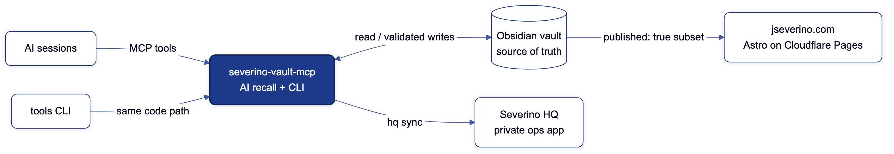

# Joe Severino

Cybersecurity graduate student at Georgia Tech focused on network security, security engineering, and the production tooling that keeps secure systems maintainable.

**Certifications:** CCNA, CompTIA Security+, ISC2 Certified in Cybersecurity (CC)

Most of my projects are built around real systems I run myself: local AI tooling with explicit safety boundaries, zero-trust homelab infrastructure, private PKI and TLS automation, DNS filtering, and the vault-to-website publishing pipeline behind my portfolio.

## Featured Projects

- **[severino-vault-mcp](https://github.com/joeseverino/severino-vault-mcp)** - Local-first MCP server that gives AI assistants safe access to an Obsidian operations vault. Layered CI security tooling (CodeQL, pip-audit, OSSF Scorecard, Dependabot), documented threat model, and a four-tier sensitivity gate for credential-adjacent content.
- **[jseverino.com](https://github.com/joeseverino/jseverino.com)** - Public Astro portfolio deployed on Cloudflare Pages from a private Obsidian vault. It uses branding-engine as its generated brand source and sitedrift on branch previews, alongside vault-to-content sync, static publishing checks, CSP hardening, and a D1-backed contact form protected by Turnstile.
- **[tools](https://github.com/joeseverino/tools)** - Cohesive personal macOS CLI suite: one umbrella command over standalone scripts that share a look, a help convention, and exit-code discipline. Their help, completions, and docs all generate from one cordon declaration per tool, and every measured README claim is asserted by a CI benchmark. It spans age encryption with Keychain-cached unlock, vault sync, dotfile backup, DNS-resolver latency diagnostics, and drift guards that diff live Tailscale, Cloudflare, AdGuard, and Nginx against their vault mirrors.
- **[cordon](https://github.com/joeseverino/cordon)** - Language-agnostic command-surface contract, the shared spec behind tools and severino-vault-mcp. Declare a CLI once and render every view from it (human help, shell completions, docs, a machine-readable spec) instead of maintaining them separately, and have each command carry its blast radius on a fixed effect ladder: read → local_write → vault_write → remote_write → deploy. That one field is what lets an agent or a runtime gate stop before a deploy it can't take back.
- **[severino-hq](https://github.com/joeseverino/severino-hq)** - Private Django 5 ops app that turns vault frontmatter into structured operational records (projects, assets, expenses, receipts, a docs index). It deploys through a gated GitHub Actions pipeline: lint, multi-version tests, a deploy-posture check, pip-audit, and a Trivy scan must all pass before a self-hosted homelab runner pulls the image and restarts the container. Nothing inbound is ever opened, a red commit can't reach the box, and sign-in is OIDC SSO through a self-hosted Pocket ID.
- **[sitedrift](https://github.com/joeseverino/sitedrift)** - Published [npm package](https://www.npmjs.com/package/sitedrift) for reviewing DEV against LIVE on the same route: split, overlay/diff, synced navigation, response deltas, and SEO checks. A two-step Cloudflare Pages addon installs it on branch previews and leaves production untouched, and an MCP interface opens the same review to AI.
- **[cert-generator](https://github.com/joeseverino/cert-generator)** - CLI that issues TLS certificates from a private root CA kept on an offline VM. The CA key never touches a networked machine; issuance runs end to end on the offline host (CSR generation, passphrase-gated signing, and cleanup that leaves no service keys behind).

## How It Fits Together

Most of these projects are pieces of one system: a private Obsidian vault is
the single source of truth, and everything else derives from it.

Diagram source: [`docs/diagrams/readme-flow.mmd`](docs/diagrams/readme-flow.mmd),
pre-rendered with [`diagram`](https://github.com/joeseverino/tools/blob/main/bin/diagram).

The full map, with every component, how they talk, and the whys, is in
**[ARCHITECTURE.md](ARCHITECTURE.md)**.

## Focus Areas

- Network security
- Infrastructure automation and secure deployment
- Local-first AI tooling with explicit safety boundaries
- TLS, PKI, and DNS
- Open-source developer tooling
- Homelab engineering

## Links

- Portfolio: https://jseverino.com
- LinkedIn: https://linkedin.com/in/joeseverino
