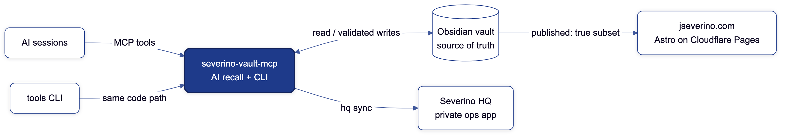

# Joe Severino

Technical Solutions Engineer at World Wide Technology. Most of my projects are built around real systems I run myself: local AI tooling with explicit safety boundaries, zero-trust homelab infrastructure, private PKI and TLS automation, DNS filtering, and the vault-to-website publishing pipeline behind my portfolio.

## Featured Projects

- **[severino-vault-mcp](https://github.com/joeseverino/severino-vault-mcp)** - Local-first MCP server that gives AI assistants safe, sensitivity-gated access to an Obsidian operations vault.
- **[jseverino.com](https://github.com/joeseverino/jseverino.com)** - Astro portfolio published from a private Obsidian vault to Cloudflare Pages, with CSP hardening and a Turnstile-protected contact form.
- **[tools](https://github.com/joeseverino/tools)** - Cohesive personal macOS CLI suite — encryption, vault sync, backups, DNS diagnostics, and infra drift guards — generated from one cordon declaration per tool.
- **[cordon](https://github.com/joeseverino/cordon)** - Language-agnostic command-surface contract: declare a CLI once, render help/completions/docs/spec from it, with each command carrying its blast radius on a fixed effect ladder.
- **[severino-hq](https://github.com/joeseverino/severino-hq)** - Private Django ops app built from vault frontmatter, deployed through a gated CI pipeline to a self-hosted homelab runner with nothing inbound ever opened.
- **[sitedrift](https://github.com/joeseverino/sitedrift)** - Published [npm package](https://www.npmjs.com/package/sitedrift) for reviewing DEV against LIVE on the same route, installable on Cloudflare Pages branch previews.
- **[cert-generator](https://github.com/joeseverino/cert-generator)** - CLI that issues TLS certificates from a private root CA kept on an offline VM.

## How It Fits Together

Most of these projects are pieces of one system: a private Obsidian vault is
the single source of truth, and everything else derives from it.

Diagram source: [`docs/diagrams/readme-flow.mmd`](docs/diagrams/readme-flow.mmd),
pre-rendered with [`diagram`](https://github.com/joeseverino/tools/blob/main/bin/diagram).

The full map, with every component, how they talk, and the whys, is in
**[ARCHITECTURE.md](ARCHITECTURE.md)**.

**Certifications:** CCNA, CompTIA Security+, ISC2 Certified in Cybersecurity (CC)
